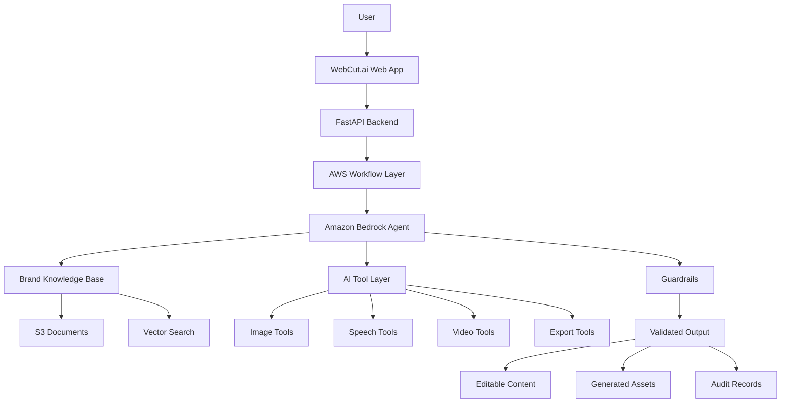
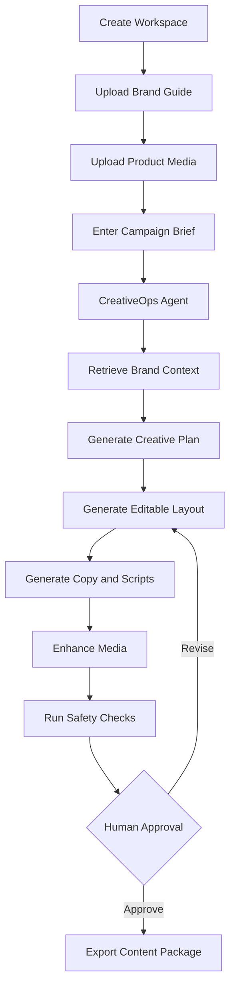
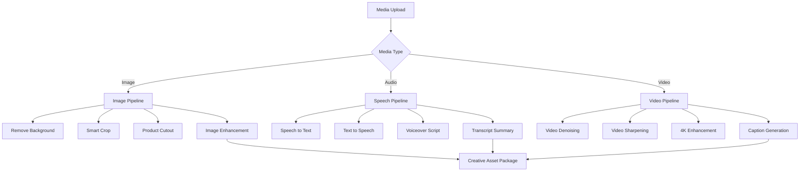
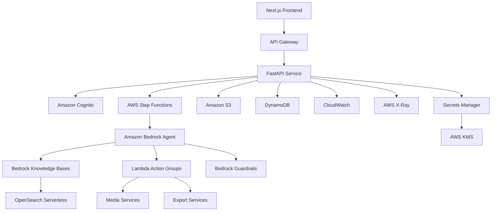
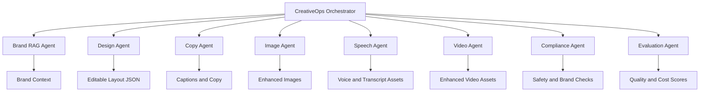
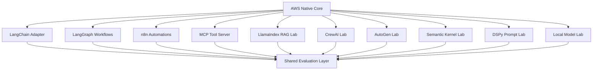
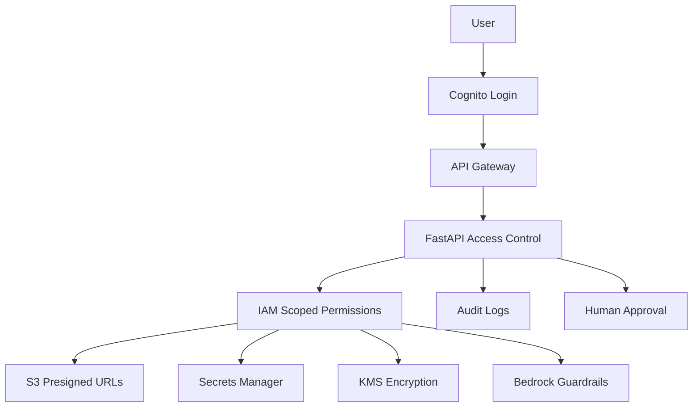
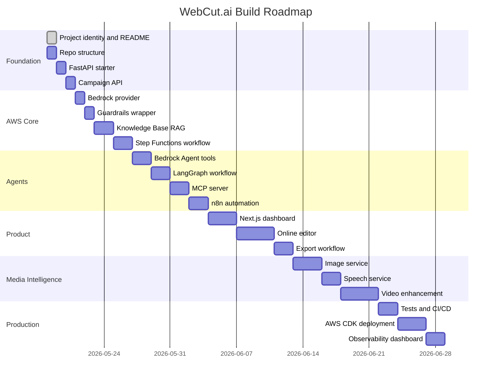

<div align="center">


<br/>


<br/>
<br/>


<br/>
<br/>

<h3>
  One platform to create, enhance, automate, govern, and export AI powered digital content.
</h3>

</div>

---

# WebCut.ai CreativeOps Agent Platform

**WebCut.ai CreativeOps Agent Platform** is an AI powered **one stop online content creation**, **media intelligence**, and **creative automation platform** built on modern full stack and AWS native generative AI architecture.

The platform is designed to help users transform brand context, product data, campaign ideas, images, videos, and audio into polished, editable, exportable, and brand aligned digital content.

WebCut.ai combines:

- AI powered online content creation
- Brand grounded content generation
- Agentic creative workflow automation
- Image enhancement and editing
- Text to Speech
- Speech to Text
- Video denoising
- Video sharpening
- 4K video enhancement
- Captions and voiceover workflows
- Human approval and governance
- Cloud native production architecture

---

## Product Mission

WebCut.ai is being built as a futuristic creative operations platform that helps users create, enhance, automate, govern, and export high quality digital content from one place.

The platform brings together content creation, media intelligence, brand grounded AI generation, workflow automation, and production grade cloud architecture into a single system.

It is designed to support real creative workflows across social media, ecommerce, marketing, video, audio, brand operations, and digital publishing.

---

## Platform Capabilities

| Area | Capability |
|---|---|
| Content Creation | Social posts, banners, thumbnails, campaign packs, ecommerce assets |
| Brand AI | Brand voice, colour rules, product information, campaign memory |
| Image Intelligence | Background removal, product cutouts, smart crop, enhancement, upscaling |
| Speech Intelligence | Text to Speech, Speech to Text, transcripts, voiceover scripts |
| Video Intelligence | Denoising, sharpening, 4K enhancement, captions, short form exports |
| Agent Automation | Planning, retrieval, generation, tool calling, validation, revision |
| Workflow Automation | Approvals, notifications, scheduled jobs, publishing drafts |
| Governance | Guardrails, human review, audit logs, safety checks, cost tracking |
| Export | PNG, JPG, PDF, MP4, campaign packages, ecommerce ready assets |

---

## Nebula Flux Identity

WebCut.ai uses a futuristic visual system called **Nebula Flux**.

| Colour | Hex | Usage |
|---|---:|---|
| Void Black | `#050816` | Deep product background |
| Space Navy | `#111827` | Platform structure |
| Nebula Purple | `#6D28D9` | AI reasoning and orchestration |
| Electric Cyan | `#00E5FF` | Speed, cloud, automation |
| Signal Pink | `#FF2D95` | Creative energy and media generation |
| Quantum Green | `#00F5A0` | Validation and successful workflows |
| AWS Amber | `#FF9900` | Cloud infrastructure and cost awareness |

---

# Product Architecture



---

# Core Workflow



---

# Media Intelligence Pipeline



---

# AWS Native Architecture



---

# Agent System



---

## Main Agents

| Agent | Responsibility |
|---|---|
| CreativeOps Orchestrator | Plans the workflow and selects the correct tools |
| Brand RAG Agent | Retrieves brand voice, colour rules, product context, and policies |
| Design Agent | Creates editable design JSON and layout structure |
| Copy Agent | Generates captions, SEO copy, product descriptions, and scripts |
| Image Agent | Handles background removal, smart crop, cutouts, enhancement |
| Speech Agent | Handles Text to Speech, Speech to Text, transcripts, and voiceovers |
| Video Agent | Handles denoising, sharpening, 4K enhancement, and captions |
| Compliance Agent | Applies safety, brand, and publishing checks |
| Evaluation Agent | Scores quality, relevance, latency, cost, and reliability |

---

## AWS Services

| Layer | AWS Service | Purpose |
|---|---|---|
| Foundation Models | Amazon Bedrock | Generate creative plans, copy, scripts, and structured outputs |
| Agents | Amazon Bedrock Agents | Orchestrate tasks and call tools |
| RAG | Bedrock Knowledge Bases | Retrieve brand and product context |
| Safety | Bedrock Guardrails | Apply safety and governance controls |
| Workflow | AWS Step Functions | Run multi step workflows with retries and failures |
| Tools | AWS Lambda | Execute agent tools and action groups |
| Storage | Amazon S3 | Store uploads, documents, generated assets, and exports |
| Vector Search | OpenSearch Serverless | Store and retrieve embeddings |
| Backend | ECS Fargate or App Runner | Run FastAPI services |
| API | Amazon API Gateway | Secure API entry point |
| Auth | Amazon Cognito | Authentication and user access |
| Database | DynamoDB | Store campaigns, jobs, outputs, and audit records |
| Secrets | AWS Secrets Manager | Store API keys and integration credentials |
| Encryption | AWS KMS | Encrypt sensitive data |
| Events | Amazon EventBridge | Trigger workflow events |
| Queue | Amazon SQS | Handle asynchronous jobs |
| Monitoring | Amazon CloudWatch | Logs, metrics, dashboards, and alarms |
| Tracing | AWS X-Ray | Trace distributed requests |
| Infrastructure | AWS CDK | Infrastructure as Code |

---

## Modern Framework Adapters

The production core is AWS native. Additional frameworks are integrated as adapters and labs.



| Framework | Usage |
|---|---|
| LangChain | Tools, retrievers, prompt templates, model abstraction |
| LangGraph | Stateful agent workflows and human in the loop flows |
| n8n | Visual automation, approvals, notifications, scheduled jobs |
| MCP | Tool server for external agent interoperability |
| LlamaIndex | Alternative RAG implementation |
| CrewAI | Multi agent role based experiments |
| AutoGen | Conversational agent experiments |
| Semantic Kernel | Enterprise orchestration comparison |
| DSPy | Prompt optimisation and evaluation |
| LiteLLM | Multi provider model gateway experiments |
| Ollama | Local model experimentation |
| vLLM | Local inference serving experiments |

---

## Example User Request

```text
Create a premium launch campaign for a black leather handbag.

Generate:
1. Instagram post
2. Ecommerce hero banner
3. Product caption
4. Voiceover script
5. Short video plan

Use a minimal luxury tone and prepare all outputs for human approval before publishing.
```

---

## Example Platform Output

```json
{
  "campaign_name": "Luxury Handbag Launch",
  "status": "ready_for_review",
  "assets": [
    {
      "type": "instagram_post",
      "format": "1080x1080",
      "headline": "Designed for Everyday Luxury",
      "description": "Minimal product focused layout with refined typography"
    },
    {
      "type": "ecommerce_hero_banner",
      "format": "1920x720",
      "headline": "The New Standard in Everyday Luxury",
      "description": "Wide hero layout with product cutout and clear call to action"
    },
    {
      "type": "voiceover_script",
      "duration_seconds": 15,
      "script": "Meet the everyday essential designed with a premium finish and timeless detail."
    },
    {
      "type": "short_video_plan",
      "duration_seconds": 12,
      "scenes": [
        "Product reveal with clean background",
        "Close up material detail",
        "Offer and call to action"
      ]
    }
  ],
  "compliance": {
    "brand_aligned": true,
    "unsupported_claims_detected": false,
    "human_approval_required": true
  }
}
```

---

## Editable Design JSON

WebCut.ai generates structured layouts that can be rendered and edited in the online editor.

```json
{
  "canvas": {
    "width": 1080,
    "height": 1080,
    "background": {
      "type": "gradient",
      "colors": ["#050816", "#6D28D9", "#00E5FF"]
    }
  },
  "layers": [
    {
      "type": "image",
      "name": "product_cutout",
      "x": 620,
      "y": 170,
      "width": 360,
      "height": 540
    },
    {
      "type": "text",
      "name": "headline",
      "text": "Designed for Everyday Luxury",
      "x": 80,
      "y": 170,
      "font_size": 62,
      "font_weight": "bold",
      "color": "#FFFFFF"
    },
    {
      "type": "text",
      "name": "call_to_action",
      "text": "Explore the launch",
      "x": 80,
      "y": 770,
      "font_size": 32,
      "color": "#00E5FF"
    }
  ]
}
```

---

## Security and Governance



| Control | Implementation |
|---|---|
| Authentication | Amazon Cognito |
| Access Control | Workspace roles and backend permissions |
| Cloud Permissions | IAM least privilege |
| Secret Storage | AWS Secrets Manager |
| Encryption | AWS KMS |
| File Access | S3 presigned URLs |
| AI Safety | Bedrock Guardrails |
| Publishing Safety | Human approval before external publishing |
| Auditability | Agent runs, tool calls, workflow logs |

---

## Observability

| Metric | Purpose |
|---|---|
| Request latency | Measure user experience |
| Model latency | Track AI response time |
| Token usage | Monitor cost |
| Tool failure rate | Improve agent reliability |
| RAG retrieval quality | Improve grounding |
| Guardrail interventions | Monitor safety events |
| Human revision rate | Measure output quality |
| Export failure rate | Track media pipeline health |
| Cost per campaign | Measure business efficiency |

---

## Repository Structure

```text
WebCut.ai-CreativeOps-Agent-Platform/
│
├── README.md
│
├── docs/
│   ├── 00_project_vision.md
│   ├── 01_architecture.md
│   ├── 02_agent_workflows.md
│   ├── 03_rag_design.md
│   ├── 04_security_guardrails.md
│   ├── 05_media_intelligence.md
│   ├── 06_evaluation_strategy.md
│   └── 07_deployment.md
│
├── apps/
│   ├── web/
│   └── api/
│
├── services/
│   ├── image-service/
│   ├── speech-service/
│   ├── video-service/
│   ├── export-service/
│   ├── shopify-service/
│   └── eval-service/
│
├── agents/
│   ├── aws-bedrock-agent/
│   ├── langgraph-agent/
│   ├── langchain-agent/
│   ├── n8n-workflows/
│   ├── mcp-server/
│   └── local-model-lab/
│
├── infra/
│   ├── cdk/
│   ├── docker/
│   └── diagrams/
│
├── tests/
│   ├── unit/
│   ├── integration/
│   ├── e2e/
│   └── evals/
│
├── docker-compose.yml
└── .github/
    └── workflows/
```

---

## Implementation Roadmap



---

## Local Development

Backend:

```bash
cd apps/api
python -m venv .venv
.venv\Scripts\activate
pip install -r requirements.txt
python -m uvicorn app.main:app --reload
```

Frontend:

```bash
cd apps/web
npm install
npm run dev
```

Docker:

```bash
docker compose up --build
```

---

## Platform Statement

<div align="center">

<h2>
WebCut.ai is a one stop online content creation, AI media intelligence, and creative automation platform powered by AWS native generative AI architecture.
</h2>

<br/>


</div>
