<!--
WebCut.ai CreativeOps Agent Platform
Modern GitHub README
-->

<div align="center">


<br />


<br />

<p>
  
  
  
  
  
  
</p>

<p>
  
  
  
  
</p>

</div>

---

## Executive Summary

**WebCut.ai CreativeOps Agent Platform** is an AWS native, full stack, agentic AI platform for generating brand compliant ecommerce and social media creative assets.

The project combines a **Canva style design experience** with **Amazon Bedrock powered AI agents**, **Retrieval Augmented Generation**, **image processing**, **workflow automation**, **cloud security**, **observability**, and **modern AI framework adapters**.

It is designed as a flagship portfolio project for:

- AI Engineer roles
- Generative AI Developer roles
- Agentic AI Engineer roles
- Full Stack AI Engineer roles
- Python Backend Engineer roles
- AWS AI Engineer roles
- Automation Engineer roles

It is also designed to support practical revision for the **AWS Certified Generative AI Developer Professional** exam by mapping every major product module to real AWS generative AI architecture patterns.

---

## Product Vision

WebCut.ai turns this:

> Create an Instagram post, Shopify hero banner, and Google Ads creative for this product. Use my brand guide, keep the design premium, remove the background, generate ecommerce copy, and prepare everything for approval.

Into this:

- Editable Instagram post
- Editable Shopify banner
- Product cutout with background removed
- Campaign concept
- Product description
- Search Engine Optimisation copy
- Social captions
- Voiceover script
- Brand compliance report
- Agent trace summary
- Export package
- Optional Shopify draft update

The key principle is simple:

> **Do not generate only a flat image. Generate an editable, auditable, brand grounded creative workflow.**

---

## Why This Project Exists

Modern AI jobs are no longer asking for only notebooks or chatbot demos.

They expect engineers who can build systems with:

- Cloud native generative AI services
- Agent orchestration
- Tool calling
- Retrieval Augmented Generation
- Model safety and guardrails
- Full stack application design
- Background jobs
- Workflow orchestration
- API integration
- Observability
- Cost control
- Security
- Testing
- Deployment

This repository is built to demonstrate those skills in one coherent end to end platform.

---

## The Gigasaurus Principle

This project intentionally touches a wide modern AI ecosystem, but it does **not** put every tool in the critical path.

### Bad Pattern

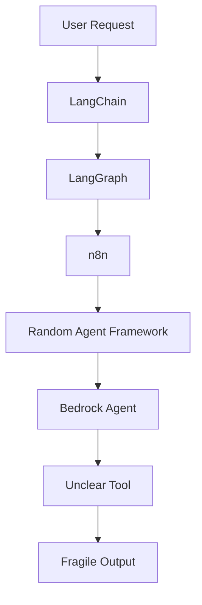

### Correct Pattern

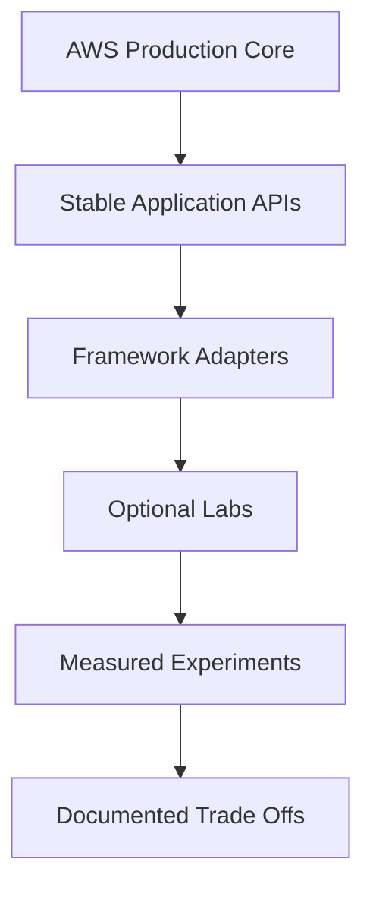

The production backbone is AWS native. Other frameworks are implemented as adapters or labs.

---

## High Level Platform Architecture

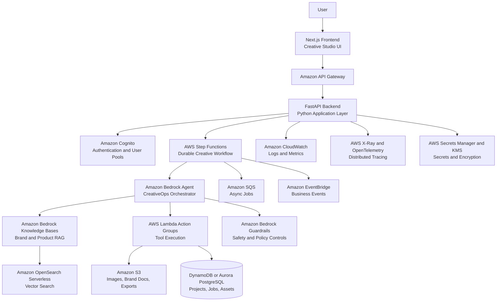

---

## Core User Workflow

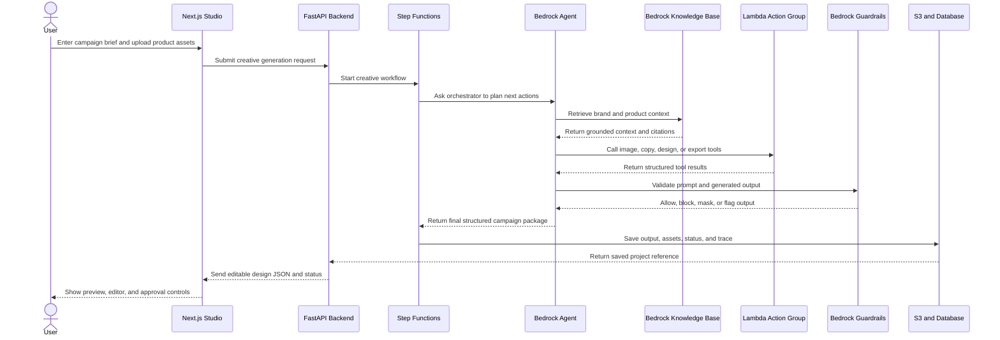

---

## AWS Native Service Map

| Capability | AWS Service | Purpose in WebCut.ai |
|---|---|---|
| Foundation model access | Amazon Bedrock | Generate campaign plans, copy, design instructions, and summaries |
| Agentic orchestration | Amazon Bedrock Agents | Coordinate tools, RAG, image operations, compliance, and publishing |
| Tool execution | AWS Lambda | Execute action groups for image tools, exports, Shopify, and database operations |
| Long running workflow | AWS Step Functions | Run durable, observable, retryable creative generation workflows |
| Visual GenAI workflow | Amazon Bedrock Flows | Optional visual workflow for prompt, model, Lambda, and Knowledge Base nodes |
| Retrieval Augmented Generation | Amazon Bedrock Knowledge Bases | Ground outputs in brand guides, product data, policy docs, and previous campaigns |
| Vector search | Amazon OpenSearch Serverless | Store and retrieve embeddings for semantic search |
| Object storage | Amazon S3 | Store uploads, source documents, generated images, and exports |
| Safety controls | Amazon Bedrock Guardrails | Filter unsafe content, sensitive information, denied topics, and policy violations |
| Authentication | Amazon Cognito | User sign up, sign in, identity, and workspace access |
| REST API boundary | Amazon API Gateway | Secure public API entry point |
| App data | DynamoDB or Aurora PostgreSQL | Store users, projects, jobs, assets, agent runs, and audit records |
| Async queue | Amazon SQS | Queue long running creative, video, and image processing jobs |
| Event automation | Amazon EventBridge | Trigger automations such as report generation and workflow notifications |
| Secrets | AWS Secrets Manager | Store provider keys, Shopify tokens, and integration secrets |
| Encryption | AWS Key Management Service | Encrypt assets, secrets, database records, and sensitive outputs |
| Logging and metrics | Amazon CloudWatch | Monitor logs, latency, failures, throughput, and costs |
| Distributed tracing | AWS X-Ray and OpenTelemetry | Trace API requests, model calls, tools, and workflow steps |
| Infrastructure as Code | AWS CDK | Deploy repeatable AWS infrastructure |
| Frontend hosting | AWS Amplify or CloudFront with S3 | Host the web application |

---

## AWS Exam Mapping

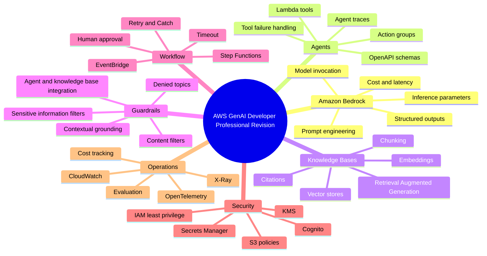

---

## Agent Architecture

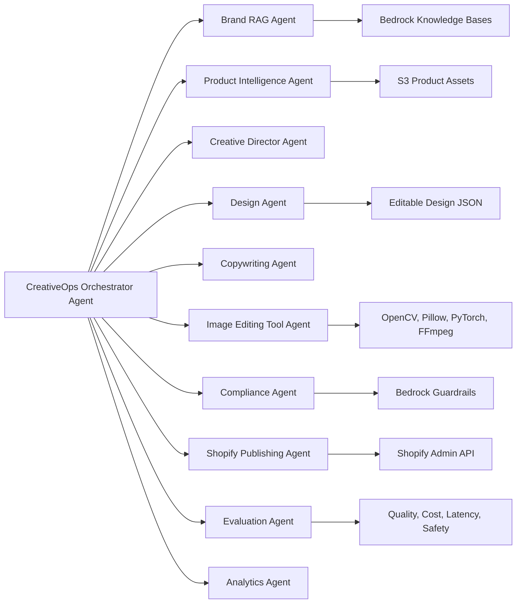

---

## Agent Responsibilities

| Agent or Tool | Responsibility |
|---|---|
| CreativeOps Orchestrator Agent | Plans the workflow and decides which tools to call |
| Brand RAG Agent | Retrieves brand rules, tone, visual identity, product facts, and citations |
| Product Intelligence Agent | Extracts useful product information from image, CSV, or Shopify input |
| Creative Director Agent | Defines creative concept, target audience, asset set, and messaging angle |
| Design Agent | Produces editable layout JSON for the Canva style editor |
| Copywriting Agent | Generates headlines, captions, descriptions, and search engine copy |
| Image Editing Tool Agent | Runs background removal, crop, enhancement, object cleanup, and export tools |
| Compliance Agent | Checks brand consistency, safety, unsupported claims, and policy risk |
| Shopify Publishing Agent | Prepares ecommerce draft content and product asset packages |
| Evaluation Agent | Scores output quality, retrieval relevance, safety, and schema validity |
| Analytics Agent | Reports cost, latency, tool calls, failures, and improvement suggestions |

---

## Framework Adapter Strategy

```mermaid
flowchart TB
    CORE[WebCut.ai Core API] --> AWS[AWS Native Runtime<br/>Bedrock + Step Functions + Lambda]
    CORE --> LG[LangGraph Runtime<br/>Stateful Agent Workflows]
    CORE --> LC[LangChain Adapter<br/>Tools, Retrievers, Prompt Templates]
    CORE --> N8N[n8n Adapter<br/>Visual Business Automation]
    CORE --> MCP[MCP Server<br/>Standard Tool Interface]
    CORE --> LLI[LlamaIndex Lab<br/>Alternative RAG]
    CORE --> CREW[CrewAI Lab<br/>Role Based Multi Agent Experiments]
    CORE --> AUTO[AutoGen Lab<br/>Conversational Agent Experiments]
    CORE --> SK[Semantic Kernel Lab<br/>Enterprise Agent Comparison]
    CORE --> DSPY[DSPy Lab<br/>Prompt Optimisation]
    CORE --> LOCAL[Local Model Lab<br/>Ollama, vLLM, Transformers]
```

---

## Technology Matrix

| Layer | Primary Stack | Alternative or Lab Stack |
|---|---|---|
| Frontend | Next.js, React, TypeScript, Tailwind CSS, shadcn/ui | Vite, React Native later |
| Editor | Fabric.js or Konva.js | SVG rendering, Canvas API |
| Backend | Python, FastAPI, Pydantic | Django REST Framework |
| AI Core | Amazon Bedrock | LiteLLM gateway, Anthropic, OpenAI, local models |
| AWS Agent Runtime | Bedrock Agents, Lambda action groups | LangGraph, CrewAI, AutoGen |
| RAG | Bedrock Knowledge Bases, OpenSearch Serverless | LlamaIndex, LangChain, pgvector, Qdrant |
| Workflow | Step Functions | n8n, LangGraph, Temporal later |
| Image Processing | OpenCV, Pillow, rembg, PyTorch | ONNX Runtime, Segment Anything style models |
| Video Processing | FFmpeg, MoviePy, Remotion | AWS Elemental MediaConvert later |
| Data | DynamoDB, Aurora PostgreSQL | PostgreSQL with pgvector |
| Storage | S3 | Local MinIO for development |
| Auth | Cognito | Auth.js or Clerk for local prototype |
| Events | EventBridge, SQS | Redis Queue or Celery locally |
| Observability | CloudWatch, X-Ray, OpenTelemetry | LangSmith optional |
| Infrastructure | AWS CDK | Terraform optional |
| Testing | Pytest, Playwright | DeepEval, RAGAS, Locust |

---

## Design JSON as the Core Output

WebCut.ai does not only return text. It returns structured design instructions that can be edited by the user.

```json
{
  "campaign_name": "Luxury Handbag Launch",
  "assets": [
    {
      "type": "instagram_post",
      "size": {
        "width": 1080,
        "height": 1080
      },
      "layers": [
        {
          "id": "background",
          "type": "shape",
          "shape": "rectangle",
          "fill": "#F7F1EA",
          "x": 0,
          "y": 0,
          "width": 1080,
          "height": 1080
        },
        {
          "id": "headline",
          "type": "text",
          "text": "The Winter Edit",
          "x": 80,
          "y": 160,
          "font_size": 72,
          "font_weight": "bold",
          "color": "#111827"
        },
        {
          "id": "product_image",
          "type": "image",
          "source": "s3://webcut-assets/product-cutout.png",
          "x": 520,
          "y": 210,
          "width": 420,
          "height": 520
        }
      ]
    }
  ],
  "brand_compliance_notes": [
    "Uses premium tone",
    "Keeps product claim conservative",
    "Uses neutral luxury palette"
  ]
}
```

---

## First Working Vertical Slice

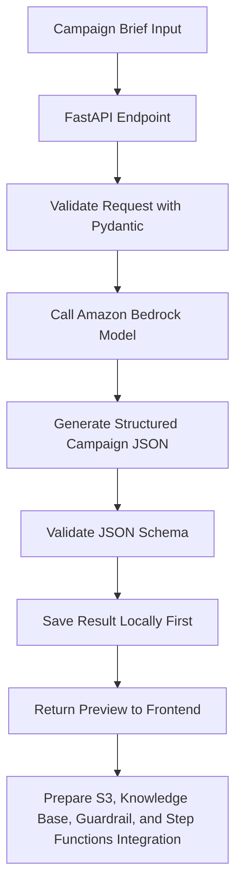

### First User Story

As a user, I want to enter a campaign brief so that WebCut.ai can generate a brand aligned creative plan and editable design layout for social media and ecommerce.

### Example Input

```text
Create an Instagram post and Shopify hero banner for a black leather handbag.
Use a premium luxury tone, keep the design minimal, and include a launch offer.
```

### Example Output

```json
{
  "campaign_name": "Luxury Handbag Launch",
  "assets": [
    {
      "type": "instagram_post",
      "size": "1080x1080",
      "headline": "The Winter Edit",
      "subheadline": "Premium leather. Minimal elegance.",
      "call_to_action": "Shop the launch offer",
      "layout": {
        "background": "warm neutral gradient",
        "product_position": "right center",
        "text_position": "left center",
        "style": "minimal luxury ecommerce"
      }
    },
    {
      "type": "shopify_hero_banner",
      "size": "1920x720",
      "headline": "Designed for Everyday Luxury",
      "subheadline": "Launch offer available for a limited time",
      "call_to_action": "Shop Now"
    }
  ],
  "brand_compliance_notes": [
    "Uses a premium tone",
    "Avoids unsupported product claims",
    "Keeps text suitable for ecommerce use"
  ]
}
```

---

## Repository Structure

```text
WebCut.ai-CreativeOps-Agent-Platform/
│
├── README.md
├── docs/
│   ├── 00_project_vision.md
│   ├── 01_aws_exam_mapping.md
│   ├── 02_architecture.md
│   ├── 03_agent_workflows.md
│   ├── 04_rag_design.md
│   ├── 05_security_guardrails.md
│   ├── 06_evaluation_strategy.md
│   ├── 07_deployment.md
│   └── 08_tool_comparison.md
│
├── apps/
│   ├── web/
│   └── api/
│
├── packages/
│   ├── shared-types/
│   └── design-schema/
│
├── services/
│   ├── image-service/
│   ├── video-service/
│   ├── export-service/
│   ├── shopify-service/
│   └── eval-service/
│
├── agents/
│   ├── aws-bedrock-agent/
│   ├── langgraph-agent/
│   ├── langchain-agent/
│   ├── n8n-workflows/
│   ├── mcp-server/
│   └── openclaw-style-assistant/
│
├── infra/
│   ├── cdk/
│   ├── docker/
│   └── diagrams/
│
├── tests/
│   ├── unit/
│   ├── integration/
│   ├── e2e/
│   └── evals/
│
└── docker-compose.yml
```

---

## Delivery Roadmap

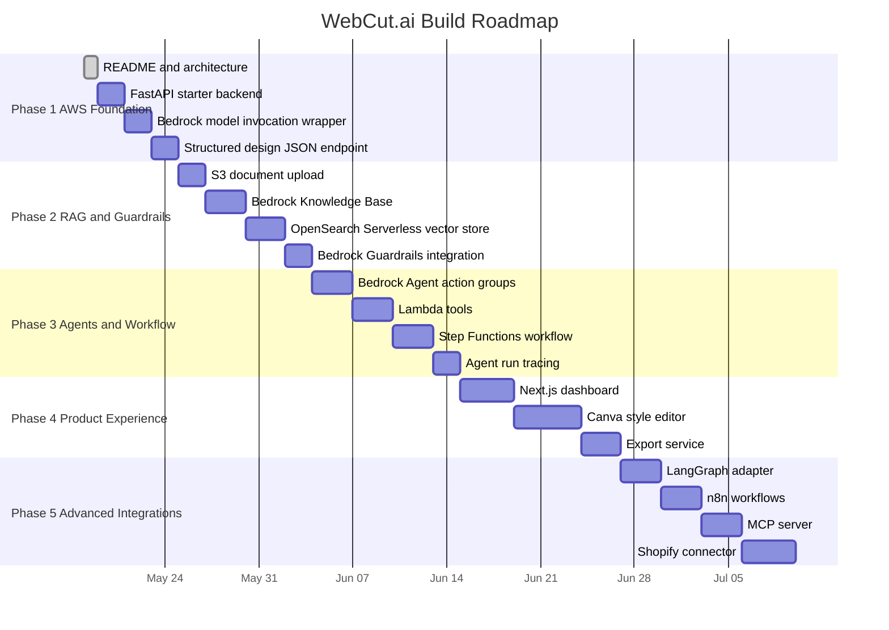

---

## System State Machine

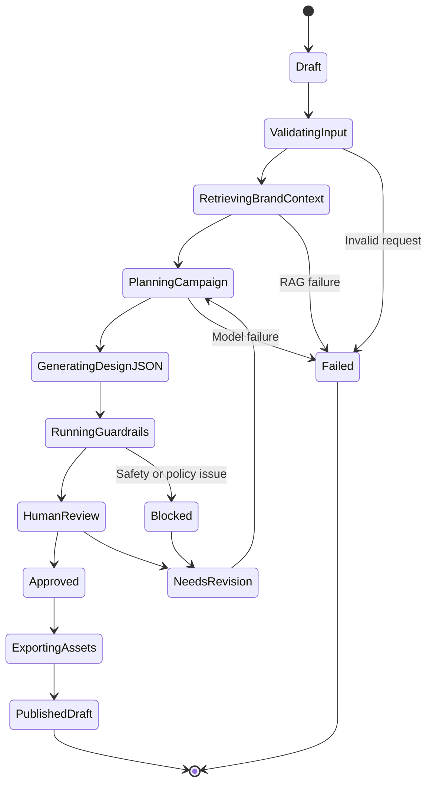

---

## Data Model Overview

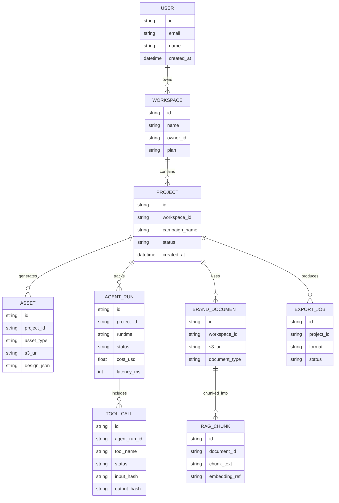

---

## Quality Gates

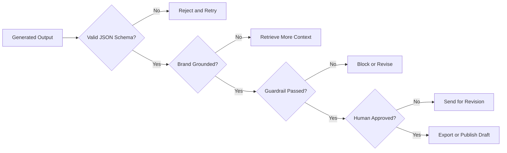

---

## Evaluation Strategy

| Evaluation Type | What It Checks | Example Metric |
|---|---|---|
| Schema evaluation | Output matches expected JSON structure | Pass or fail |
| RAG relevance | Retrieved context matches user request | Relevance score |
| Faithfulness | Generated output does not invent unsupported brand claims | Groundedness score |
| Safety evaluation | Prompt and response pass safety filters | Guardrail result |
| Design quality | Layout is usable, readable, and brand aligned | Human or rubric score |
| Agent reliability | Correct tool selected and called successfully | Tool success rate |
| Latency | Time from request to usable preview | Milliseconds |
| Cost | Token and infrastructure cost per generation | Estimated dollars |
| Regression | Old prompts still produce valid outputs | Test suite pass rate |

---

## Local Development Target

The local version should run without requiring every AWS resource immediately.

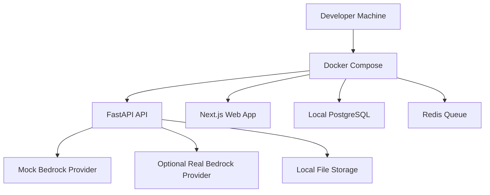

This allows fast development first, then AWS integration module by module.

---

## Planned API Endpoints

| Method | Endpoint | Purpose |
|---|---|---|
| `POST` | `/api/v1/campaigns/generate` | Generate campaign plan and design JSON |
| `POST` | `/api/v1/assets/upload` | Upload product images and brand documents |
| `GET` | `/api/v1/projects/{project_id}` | Read project details |
| `GET` | `/api/v1/projects/{project_id}/runs` | Read agent run history |
| `POST` | `/api/v1/exports` | Export design to PNG, JPG, PDF, or MP4 |
| `POST` | `/api/v1/rag/query` | Query brand knowledge base |
| `POST` | `/api/v1/guardrails/check` | Run safety and brand compliance check |
| `POST` | `/api/v1/shopify/draft` | Create Shopify draft update |
| `GET` | `/api/v1/health` | Health check |
| `GET` | `/api/v1/version` | Version metadata |

---

## AWS Production Deployment View

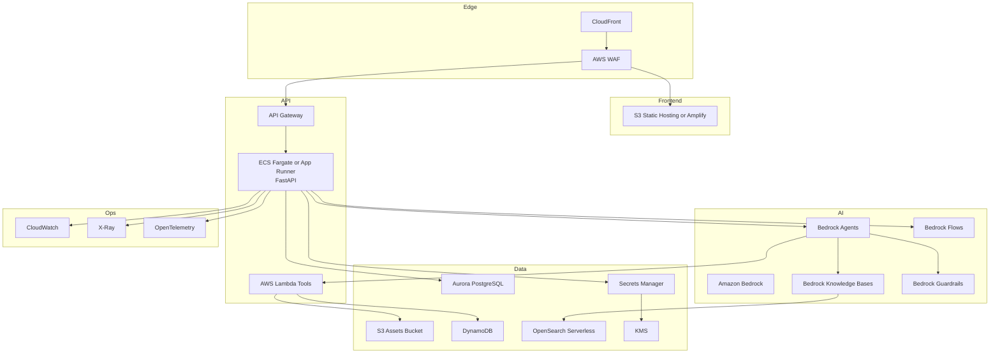

---

## Security Architecture

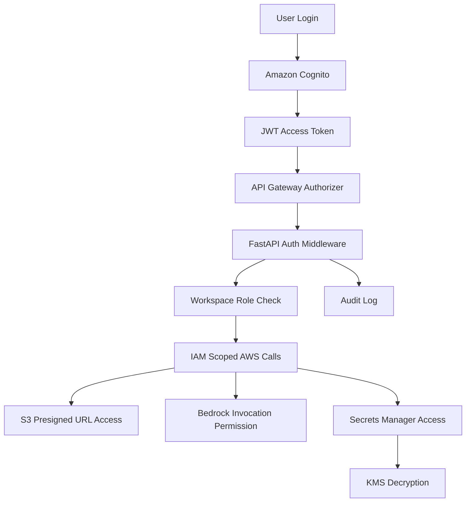

Security controls include:

- Identity based access with Amazon Cognito
- Workspace level access control
- IAM least privilege policies
- S3 presigned URLs
- KMS encryption
- Secrets Manager for external API credentials
- Bedrock Guardrails for safety and privacy
- Audit logs for agent actions
- Human approval before external publishing

---

## Observability Dashboard Goals

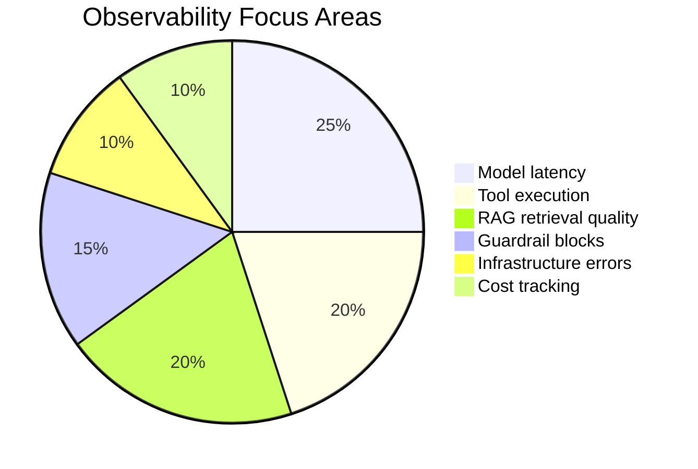

The platform will track:

- Request latency
- Token usage
- Estimated model cost
- Tool call count
- Tool failure count
- Retry count
- RAG retrieval scores
- Guardrail decisions
- Export job duration
- User approval rate

---

## n8n Automation Examples

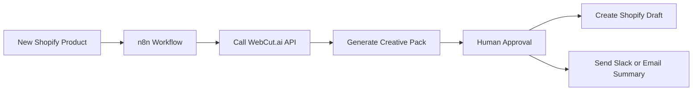

Example workflows:

- New Shopify product triggers creative pack generation
- Approved campaign sends assets to marketing channel
- Failed generation creates a GitHub issue
- High cost event notifies admin
- New brand guide upload triggers knowledge base ingestion
- Weekly creative performance summary is generated automatically

---

## MCP Tool Server Plan

The WebCut.ai Model Context Protocol server will expose controlled tools for agents.

```text
search_brand_guide
generate_campaign_plan
generate_design_json
remove_background
smart_crop
export_asset
check_brand_compliance
get_shopify_product
create_shopify_draft
calculate_generation_cost
run_quality_evaluation
```

Permission principle:

> External agents can draft, inspect, and request generation, but cannot publish or delete without explicit human approval.

---

## Build Phases

### Phase 1: AWS Foundation

- Replace legacy README
- Create project structure
- Build FastAPI backend
- Add Bedrock model invocation wrapper
- Add structured campaign output schema
- Add local project persistence
- Add unit tests

### Phase 2: RAG and Guardrails

- Upload brand documents to S3
- Create Bedrock Knowledge Base
- Connect OpenSearch Serverless vector store
- Add retrieval citations
- Add Bedrock Guardrails
- Add RAG quality tests

### Phase 3: Bedrock Agents and Step Functions

- Create CreativeOps Orchestrator Agent
- Add Lambda action groups
- Define tool schemas
- Add Step Functions workflow
- Add retry, catch, timeout, and approval states
- Add agent trace logging

### Phase 4: Web Studio

- Build Next.js dashboard
- Add creative generation form
- Add editable design preview
- Add Canva style editor
- Add asset history
- Add export buttons

### Phase 5: Media Tools

- Add background removal
- Add product cutout
- Add smart crop
- Add image enhancement
- Add video timeline generation
- Add MP4 export

### Phase 6: Ecommerce Automation

- Add Shopify product import
- Generate product descriptions
- Generate SEO metadata
- Generate product image packs
- Create draft product updates
- Add approval workflow

### Phase 7: Framework Labs

- Add LangGraph implementation
- Add LangChain adapter
- Add n8n workflows
- Add MCP server
- Add LlamaIndex RAG comparison
- Add CrewAI, AutoGen, Semantic Kernel, DSPy labs
- Add local model experiments with Ollama, vLLM, and Hugging Face Transformers

---

## Recruiter Positioning

This project demonstrates:

| Job Requirement | How WebCut.ai Proves It |
|---|---|
| Full stack engineering | Next.js frontend, FastAPI backend, editor, APIs, authentication |
| Python engineering | FastAPI, Pydantic, workers, AI services, tests |
| Cloud AI development | Amazon Bedrock, Agents, Knowledge Bases, Guardrails, Lambda |
| Agentic AI | Orchestrator agent, tool calling, action groups, workflows |
| RAG | Brand guide retrieval, citations, vector search, evaluation |
| Automation | Step Functions, EventBridge, SQS, n8n |
| Security | Cognito, IAM, KMS, Secrets Manager, Guardrails |
| Observability | CloudWatch, X-Ray, OpenTelemetry, cost tracking |
| DevOps | Docker, GitHub Actions, CDK, deployment |
| Product thinking | Real ecommerce creative workflow with approval and publishing |

---

## Resume Bullet

> Built WebCut.ai CreativeOps Agent Platform, an AWS native full stack AI SaaS system for generating ecommerce and social media creative assets using Amazon Bedrock, Bedrock Agents, Knowledge Bases, Guardrails, Lambda action groups, Step Functions, S3, OpenSearch Serverless, FastAPI, Next.js, and CloudWatch. Designed agentic workflows for campaign planning, brand grounded RAG, editable design JSON generation, compliance validation, image processing, export automation, and Shopify draft publishing.

---

## Interview Pitch

> WebCut.ai is my flagship full stack AI engineering project. It is a Canva style creative automation platform where ecommerce teams upload product data and brand guides, then AWS powered AI agents generate editable, brand compliant creative assets. The production backbone uses Amazon Bedrock, Bedrock Agents, Knowledge Bases, Guardrails, Lambda action groups, Step Functions, S3, OpenSearch Serverless, FastAPI, Next.js, and CloudWatch. Around that core, I built adapters for LangGraph, LangChain, n8n, MCP, and local model experimentation so I can compare orchestration patterns and production trade offs.

---

## Current Status

```mermaid
flowchart LR
    A[Project Vision] --> B[Modern README]
    B --> C[Repository Structure]
    C --> D[FastAPI Starter]
    D --> E[Bedrock Wrapper]
    E --> F[RAG and Guardrails]
    F --> G[Agents and Step Functions]
    G --> H[Frontend Studio]
    H --> I[Production Deployment]

    A:::done
    B:::active

    classDef done fill:#16a34a,color:#ffffff,stroke:#166534;
    classDef active fill:#2563eb,color:#ffffff,stroke:#1e3a8a;
```

---

## Next Engineering Step

Create the first working backend vertical slice:

```text
apps/api
  app/main.py
  app/config.py
  app/models/campaign.py
  app/services/bedrock_client.py
  app/routes/campaigns.py
  tests/test_campaigns.py
```

The first backend endpoint will accept a campaign brief and return structured campaign JSON.

---

<div align="center">


**WebCut.ai CreativeOps Agent Platform**  
**AWS native. Agentic. Full stack. Production shaped. Portfolio ready.**

</div>
